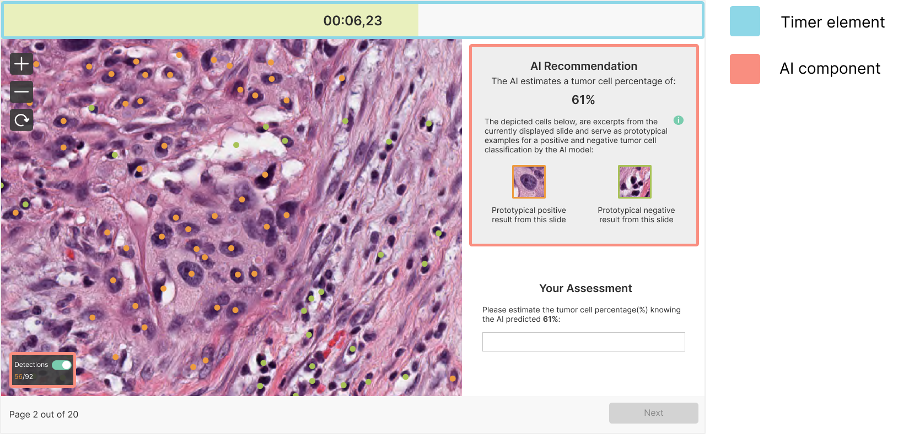

# Automation Bias in AI-Assisted Medical Decision-Making Under Time Pressure in Computational Pathology

## Overview

This repository contains the source code and materials for *Automation Bias in AI-Assisted Medical Decision-Making Under Time Pressure in Computational Pathology*. We quantified automation bias in the form of negative consultations, where a correct initial assessment was overturned by incorrect AI guidance, and examined the impact of time constraints in a web-based experiment. In this study, trained pathology experts (n=28) estimated tumor cell percentages.<br>


## Contents

- **ExperimentApplication**: The `ExperimentApplication/` directory contains the Django project source code for the experiment interface, where participants rated tumor cell percentages. The `static/` subdirectory includes study materials, such as image patches from different H&E-stained tissue slides (licensed under Creative Commons) and a table with additional information on these study images.
- **DataAnalysis**: The `DataAnalysis/` directory includes the code to assess data normality, perform parametric tests, and generate descriptive statistics reported in the paper.

## Running the Online Experiment Interface

1. Clone or download this repository, extract the files into a directory of your choice, and navigate to the `ExperimentApplication/` subdirectory.

2. Ensure Python is installed, then create a new virtual environment and install the required packages using: 
```
pip install -r requirements.txt
```
In Visual Studio Code, you may need to set or change the Python interpreter.

3. To start the experiment interface, run the following commands, and access it via http://127.0.0.1:8000/ or http://127.0.0.1:8000/XAI (for the AI-assisted version).
```
python manage.py makemigrations
python manage.py migrate
python manage.py runserver
```
## License
The images in the ```ExperimentApplication/static``` directory were obtained with necessary rights and modified (e.g., for cell detection visualization) to meet study requirements. We publish these images for public use under the Creative Commons 4.0 BY-NC-SA License.
